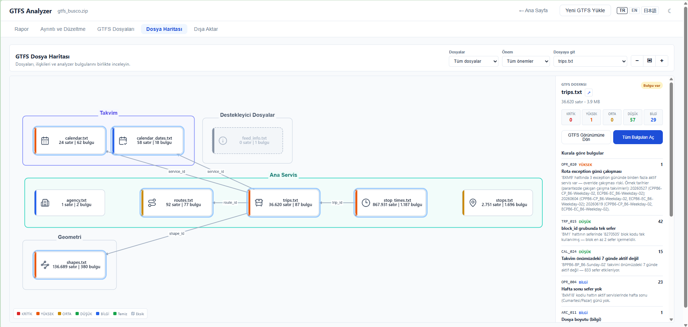

# GTFS Validator & Analyzer

🇹🇷 **Türkçe** · 🇬🇧 [English](README.en.md) · 🇯🇵 [日本語](README.ja.md)

[](https://ttezer.github.io/gtfs-analyzer/)
[](https://www.gtfs.jp/)
[](https://gtfs.org/)
[](LICENSE)

GTFS Validator & Analyzer, GTFS dosyalarını doğrudan tarayıcıda doğrulayan ve feed kalitesini analiz eden açık kaynak bir GTFS validator aracıdır. Yüklenen .zip dosyası hiçbir sunucuya gönderilmez; tüm işlemler WebAssembly ile kullanıcının cihazında gerçekleştirilir.

GTFS Validator & Analyzer yalnızca dosyanın spesifikasyona uygun olup olmadığını kontrol etmez; feed'in ne kadar güvenilir, tutarlı ve kullanılabilir olduğunu da analiz eder. Hataları ilgili dosya ve satır numarasıyla birlikte gösterir, her bulgu için düzeltme adımları sunar ve coğrafi sorunları — örneğin sapan güzergâhlar, bozuk koordinatlar veya erişilemeyen duraklar — interaktif harita üzerinde işaretler.

Her bulgu; kural kodu, analiz sınıfı ve önem seviyesiyle etiketlenir. Spec · Interop · Quality · Analytics sınıfları ile Kritik → Bilgi önem seviyeleri sayesinde binlerce bulgu filtrelenebilir, önceliklendirilebilir ve sistematik biçimde ele alınabilir. Araç ayrıca feed'in kullandığı GTFS özelliklerini — Shapes, Transfers, Fares, Headsigns, Flex ve benzerlerini — otomatik olarak tespit ederek rapora dahil eder.

GTFS Validator & Analyzer, spesifikasyon doğrulamasını operasyonel kalite analiziyle genişletir. Hat bazında sefer sıklığı tutarsızlıkları, anormal hız segmentleri, izole duraklar,servis desenlerindeki boşluklar ve ağ topolojisi problemleri 543 farklı doğrulama ve analiz kuralıyla incelenir. Sonuçlar, uyumluluk ve kaliteyi ayrı ayrı değerlendiren skorlarla özetlenir. Önceliklendirilmiş düzeltme kuyruğu ise hangi sorunların önce ele alınması gerektiğini ve yapılacak düzeltmelerin skora olası etkisini gösterir.

**Kimler için?**

- **Toplu taşıma işletmecileri ve belediyeler** — Feed'i yayına almadan önce doğrulamak ve kalite sorunlarını gidermek için.
- **GTFS entegratörleri ve danışmanlar** — Teslim edilen verinin teknik ve operasyonel kalitesini belgelemek için.
- **Uygulama geliştiriciler** — Kullandıkları feed'in güvenilirliğini ve entegrasyon risklerini değerlendirmek için.
- **Araştırmacılar ve analistler** — Farklı toplu taşıma ağlarını veri kalitesi ve yapı bakımından karşılaştırmak için.

---

## Diğer Araçlarla Karşılaştırma

### Özellikler

| Özellik | MobilityData | GTFS Guru | GTFS Analyzer |
|---|:---:|:---:|:---:|
| Web arayüzü | ✅ | ✅ | ✅ |
| Veri sunucuya gitmiyor | ❌ | ✅ | ✅ |
| Spec uyum kuralları | ✅ | ✅ | ✅ |
| Kalite kuralları | ❌ | ❌ | ✅ |
| Operasyonel analitik | ❌ | ❌ | ✅ |
| Harita görselleştirme | ❌ | ❌ | Durak, güzergah, sefer, hat, pathway |
| Feed skoru | ❌ | ❌ | ✅ |
| Düzeltme önerisi | Kısmi | ❌ | ✅ |
| GTFS Flex desteği | Kısmi | ❌ | ✅ |
| Fares v2 doğrulama | Kısmi | ❌ | ✅ |
| GTFS-JP profil doğrulama | ❌ | ❌ | ✅ |
| Çıktı formatı | HTML, JSON | HTML, JSON | HTML, CSV, JSON, PDF |
| Platform | Web | Web, CLI, Desktop | Web, CLI *(Desktop planlanmış)* |
| **Toplam kural** | **178** | **~120** | **543** |

### Feed Analizi Örnekleri

Aynı feed'ler iki validator ile karşılaştırıldı: MobilityData gtfs-validator v8.0.1 · GTFS Analyzer v0.6.0. (GTFS Analyzer sayıları 2026-07-24 tarihli çalıştırmanın anlık görüntüsüdür; tarihe bağlı kurallar nedeniyle farklı bir günde çalıştırma küçük sapmalar verebilir.)

#### BART (Bay Area Rapid Transit, San Francisco)

Feed: `mdb-53` (MobilityDatabase, 2026-07-15 anlık görüntüsü; geçerlilik aralığı: 2026-01-12–2026-08-30) · 14 hat, 287 durak, 7.036 sefer.

| | MobilityData | GTFS Analyzer |
|---|---:|---:|
| Toplam notice | 2.745 | 1.227 |
| Kritik / Error | 2 | 2 |
| Yüksek / Warning | 2.656 | 4 |
| Orta | — | 21 |
| Düşük | — | 65 |
| Bilgi / Info | 87 | 1.135 |
| Tetiklenen kural tipi | 12 | **45** |
| Yayın skoru | — | **92,6 / 100** |
| Genel skor | — | **90,6 / 100** |

#### TriMet (Portland, Oregon)

Feed: `mdb-247` (MobilityDatabase, 2026-07-15 anlık görüntüsü; geçerlilik aralığı: 2026-07-05–2026-11-28) · 112 hat, 6.480 durak, 70.557 sefer.

| | MobilityData | GTFS Analyzer |
|---|---:|---:|
| Toplam notice | 970 | 6.356 |
| Kritik / Error | 908 | 0 |
| Yüksek / Warning | 49 | 795 |
| Orta | — | 117 |
| Düşük | — | 1.908 |
| Bilgi / Info | 13 | 3.536 |
| Tetiklenen kural tipi | 9 | **54** |
| Yayın skoru | — | **100 / 100** |
| Genel skor | — | **84,1 / 100** |

> ⚠️ **Çakışan blok seferleri:** Bu feed'in baskın bulgusu, aynı blokta zaman bakımından çakışan seferler (MobilityData'da 908 *error*). GTFS Analyzer aynı olguyu TRP_022 ile yakalar; iki araç da yalnızca aynı gün aktif servisleri çakışma sayar (takvim-kesişim). Fark sayım birimindedir: MobilityData çakışan her sefer **çiftini** ayrı sayar (908), GTFS Analyzer ise aynı sefere ait tekrarlı çakışmaları tek kayda indirir (770) — yoğun bloklardaki tekrarı bastırır. Önem sınıflandırması da farklıdır (Analyzer'da kritik değil).
>
> ⚠️ **Fares v2:** Bu feed ağ atamasını `routes.txt`'teki `network_id` sütunuyla yapar (`networks.txt` yok — geçerli bir GTFS Fares v2 yöntemi). GTFS Analyzer `fare_leg_rules.txt` içindeki `network_id` referanslarını üç kaynağın tümünden (`networks.txt`, `routes.txt`, `route_networks.txt`) çözer; bu nedenle geçerli tanımlarda yanlış kritik üretmez (bu feed'de 0 kritik). Gerçekten tanımsız `network_id` gibi Fares v2 referans bütünlüğü sorunları ise kritik olarak raporlanır (FAR/FPD/FLG/FTR/RCT/FMD grupları). MobilityData da Fares v2'yi doğrular (şema + referans bütünlüğü + fare_transfer/products/media/timeframes kuralları), ancak kapsam ve önem sınıflandırması farklılık gösterir.

#### Tokyo Toei (Tokyo Metropolitan Bureau of Transportation)

Feed: `mdb-3175` (MobilityDatabase, 2026-07-24 anlık görüntüsü; geçerlilik aralığı: 2026-07-24–2029-07-23) · 151 hat, 5.370 durak, 67.661 sefer.

| | MobilityData | GTFS Analyzer |
|---|---:|---:|
| Toplam notice | 2.458 | 2.773 |
| Kritik / Error | 0 | 0 |
| Yüksek / Warning | 330 | 22 |
| Orta | — | 964 |
| Düşük | — | 1.120 |
| Bilgi / Info | 2.128 | 667 |
| Tetiklenen kural tipi | 9 | **55** |
| Yayın skoru | — | **100 / 100** |
| Genel skor | — | **84,2 / 100** |

> 🗾 **Spec-temiz ama operasyonel olarak yoğun:** Her iki araç da 0 kritik bulur — feed spec açısından temiz. Fark analitik katmanda: GTFS Analyzer'ın orta/düşük bulgularının çoğu 3 yıllık geçerlilik penceresi (2026–2029) ve yoğun şebeke/şekil desenlerinden gelen operasyonel sinyallerdir; MobilityData bu feed'i ağırlıkla uyarı/bilgi olarak özetler.

#### VBB (Berlin-Brandenburg Ulaşım Birliği)

Feed: `mdb-782` (MobilityDatabase, 2026-07-23 anlık görüntüsü; geçerlilik aralığı: 2026-07-21–2026-12-12) · 1.262 hat, 41.949 durak, 253.494 sefer, 14.084 shape · ~75 MB. Bu feed, MobilityData'nın barındırılan web doğrulayıcısının işleyemeyeceği kadar büyüktür; MobilityData sayıları masaüstü uygulamasıyla üretilen rapordandır. GTFS Analyzer feed'i doğrudan tarayıcıda (~15 sn) doğrular.

| | MobilityData | GTFS Analyzer |
|---|---:|---:|
| Toplam notice | 11.912 | 28.380 |
| Kritik / Error | 0 | 0 |
| Yüksek / Warning | 11.193 | 2.436 |
| Orta | — | 7.439 |
| Düşük | — | 8.530 |
| Bilgi / Info | 719 | 9.975 |
| Tetiklenen kural tipi | 19 | **97** |
| Yayın skoru | — | **100 / 100** |
| Genel skor | — | **77,8 / 100** |

> 🇩🇪 **Büyük feed, farklı odak:** Her iki araç da 0 kritik bulur — feed spec açısından temizdir. MobilityData toplamının yarıdan fazlası (`non_ascii_or_non_printable_char`, 6.810) feed'in Almanca metnindeki meşru ü/ö/ä/ß karakterleridir; GTFS Analyzer geçerli Unicode harfleri işaretlemez, yalnız yazdırılamaz/kontrol karakterlerini. GTFS Analyzer'ın hacmi ise MobilityData'da bulunmayan operasyonel/geometrik analitiğe (şekil, durak, istatistiksel süre) dayanır. Çekirdek kontrollerde iki araç hizalıdır: `stop_without_stop_time` (STP_020) ve `service_has_no_active_day_of_the_week` (CAL_006) sırasıyla 1.411 ve 991 ile birebir eşleşir.

---

## GTFS-JP Desteği

GTFS Analyzer, Japonya'nın ulusal GTFS profili **GTFS-JP**'yi (国土交通省 / MLIT standardı) otomatik olarak tanır ve standart GTFS'in isteğe bağlı bıraktığı, GTFS-JP'nin zorunlu kıldığı kuralları uygular. MLIT, sübvansiyon alan işletmecilerden GTFS-JP yayımlamasını şart koştuğu için yüzlerce küçük operatör bu profile uymak zorundadır; ancak yaygın doğrulayıcılar profile özgü zorunlulukları denetlemez.

**Otomatik tespit.** Bir feed; `*_jp.txt` dosyaları (`agency_jp.txt`, `office_jp.txt`, `routes_jp.txt`) içeriyorsa, `feed_lang` değeri `ja` ile başlıyorsa ya da `translations.txt` içinde kana (`ja-Hrkt`) okumaları taşıyorsa GTFS-JP olarak işaretlenir ve raporda **GTFS-JP** rozeti görünür. Profil kuralları yalnızca bu feed'lerde devreye girer; standart feed'lerde sessiz kalır.

**Profil kuralları (JPN grubu).**

| Kural | Denetim |
|---|---|
| **JPN_001** | Durak adlarının kana (よみがな — `translations.txt`, `ja-Hrkt`) okuması; sesli anons ve arama için GTFS-JP'de zorunludur |
| **JPN_002** | `jp_office_id` (`trips.txt` **veya** `routes.txt`) değerinin `office_jp.txt`'teki bir `office_id` ile eşleşmesi (işletme ofisi referans bütünlüğü) |
| **JPN_003** | `agency_jp.txt` `agency_id` değerinin `agency.txt`'te tanımlı olması (işletici referans bütünlüğü) |
| **JPN_004** | `translations.txt`'in mevcudiyeti — GTFS-JP'de (özellikle kana okumaları için) zorunludur |
| **JPN_005** | `office_jp.txt`'te `office_name` zorunlu alanının dolu olması |
| **JPN_006** | `fare_attributes.txt` + `fare_rules.txt`'in mevcudiyeti — GTFS-JP'de zorunludur |
| **JPN_007** | `feed_info.txt`'in mevcudiyeti — GTFS-JP'de zorunludur |
| **JPN_008** | Hat adının (`route_long_name`) kana (`ja-Hrkt`) okuması |
| **JPN_009** | `trip_headsign` kana (`ja-Hrkt`) okuması |
| **JPN_010** | İşletici adının (`agency_name`) kana (`ja-Hrkt`) okuması |

Yukarıdaki **Tokyo Toei** karşılaştırması bu profilin gerçek bir GTFS-JP feed'inde nasıl davrandığını gösterir: feed spec açısından temizdir (0 kritik) ve profil kuralları doğru referanslı veride yanlış pozitif üretmez.

---

## Kullanım

GTFS Validator & Analyzer bir web uygulamasıdır; kurulum gerektirmez. Canlı sürümü tarayıcıda açıp GTFS zip dosyanızı yükleyin.

Motor tarayıcı yeteneğine göre otomatik seçilir: Memory64 destekleniyorsa 4 GB üzerindeki
büyük feed'ler için **WASM64**, desteklenmiyorsa **WASM32** kullanılır. Aktif motor yükleme
ekranında gösterilir. Hata ayıklamak için `?wasm32=1`, `?wasm64=1` veya `?serial=1` kullanılabilir.

**→ [https://ttezer.github.io/gtfs-analyzer/](https://ttezer.github.io/gtfs-analyzer/)**

1. GTFS zip dosyanızı sürükleyip bırakın ya da dosya seçiciyle yükleyin.
2. Doğrulama otomatik başlar; ilerleme ekranda aşama aşama gösterilir.
3. Tamamlandığında Yayın ve Genel skorları ile ayrıntılı rapor sekmeleri görünür.
4. Önceki bir analizi karşılaştırmak için **Karşılaştır** sekmesinden eski Golden JSON'u yükleyin. Düzeltilen, yeni, azalan ve artan kurallar; skorlar, feed tarihleri ve normalize edilmiş notice yoğunlukları birlikte gösterilir.
5. Paylaşılabilir bir çıktı için **Dışa Aktar → Yönetici PDF Raporu** yolunu açın, rapor dilini seçin ve önizlemedeki **Yazdır / PDF Kaydet** düğmesini kullanın.

### Yönetici PDF Raporu

**Yönetici PDF Raporu**, ayrıntılı doğrulama sonuçlarını karar vericiler ve feed üreticileri için okunabilir, renkli ve A4 uyumlu bir belgeye dönüştürür. Rapor yalnızca **GTFS Analyzer** sonuçlarından oluşturulur; başka bir validator sonucu veya harici karşılaştırma içermez.

Rapor şunları kapsar:

- yayınlanabilirlik durumu, Yayın Skoru, Genel Skor ve Spec · Interop · Quality · Analytics bileşenleri;
- durak, hat, sefer, shape, servis günü ve tarih aralıklarından oluşan feed profili;
- R1 yayın engelleri ile R9 etki/efor sıralamasını birleştiren, kural bazında tekilleştirilmiş **P0 / P1 / P2** aksiyonları;
- her öncelikli bulgu için kanıt, etkisi, önerilen düzeltme, etkilenen gerçek örnek sayısı ve olası skor kazanımı;
- feed'e özgü yapısal içgörüler, aşamalı iyileştirme planı, önem/sınıf dağılımları ve teknik ek.

Arayüzde performans için sınırlandırılmış bulgu örnekleri bulunsa bile rapor, mevcut olduğunda `capped_totals` içindeki **gerçek toplu sayıları** kullanır. Belge Türkçe, İngilizce veya Japonca üretilebilir; rapor dili arayüz dilinden bağımsız seçilir. Oluşturma ve yazdırma işlemi tamamen tarayıcıda gerçekleşir, GTFS verisi sunucuya gönderilmez ve harici API kullanılmaz.

> Rapor skorları yüklenen GTFS feed'ini değerlendirir; GTFS Analyzer uygulamasının performansını veya doğruluğunu puanlamaz.

> Kendi sunucunuzda barındırmak veya geliştirme ortamı kurmak için [Geliştirici Kurulumu](#geliştirici-kurulumu) bölümüne bakın.

---

## CLI (Terminal)

Web arayüzü dışında, aynı doğrulama çekirdeğini (`gtfs_pipeline::validate_bytes`) terminalden çalıştırabilirsiniz — Python/otomasyon entegrasyonu için.

### Kurulum

Rust kurmadan: [Releases](https://github.com/ttezer/gtfs-analyzer/releases) sayfasından platformunuza uygun arşivi indirin (`x86_64-linux`, `aarch64-macos`, `x86_64-windows`), açın ve `gtfs-analyzer` binary'sini `PATH`'inize koyun.

```bash
# Linux / macOS — en son sürüm
curl -sL https://github.com/ttezer/gtfs-analyzer/releases/latest/download/gtfs-analyzer-x86_64-linux.tar.gz | tar xz
./gtfs-analyzer --version
```

Kaynaktan derlemek için:

```bash
cargo build --release -p gtfs-cli
target/release/gtfs-analyzer validate feed.zip --json

# ya da doğrudan
cargo run -p gtfs-cli -- validate feed.zip --json
```

### `validate` — feed doğrulama

| Bayrak | Açıklama |
|---|---|
| `--json` | Sonucun tamamını JSON olarak yazar |
| `--summary` | Kısa özet: durum, notice sayısı, skorlar (varsayılan; `--json` ile birlikte kullanılamaz) |
| `--rule SHP_010` | Yalnızca verilen kural için notice'lar |
| `--severity critical` | Tam olarak bu öneme sahip notice'lar (critical/high/medium/low/info) |
| `--min-severity high` | Bu önem ve daha ağırı (critical en ağır) |
| `--class spec` | Yalnızca bu kural sınıfları — `spec,interop,quality,analytics`, virgülle çoklu |
| `--fail-on critical` | Exit 1 **yalnızca** bu önem ve daha ağırı varsa |
| `--fail-on-class spec` | Exit 1 yalnızca bu sınıflarda notice varsa |
| `--pretty` | JSON'ı girintili yazar (`--json` gerektirir) |
| `--include-name-index` | `name_index`'i (durak/hat/shape arama tabloları) JSON'a dahil eder |
| `-o rapor.json` | Çıktıyı stdout yerine dosyaya yazar |
| `--lang en` | Bulgu metinlerinin dili: `tr` (varsayılan) / `en` / `ja` |
| `--config config.json` | JSON config delta uygular (`ValidatorConfig::default()` üzerine) |
| `--today 20260710` | Analiz "bugün"ünü sabitler (takvim kuralları için) |

**Filtreler yalnızca görüntülemeyi daraltır.** `notices` ve R2–R9 listeleri filtrelenir; **R1 yayınlanabilirlik kararı ve R5 skorları her zaman tüm feed'i** anlatır. Filtre uygulandığında JSON'a `filtered` alanı, özete `filter:` satırı eklenir.

`name_index` varsayılan olarak **çıktıya dahil edilmez**: büyük feed'lerde shape/durak koordinat tabloları JSON'un neredeyse tamamını kaplar. Gerekiyorsa `--include-name-index` ile açın.

Feed yolu yerine `-` verilirse ZIP **stdin'den** okunur: `curl -sL <url> | gtfs-analyzer validate - --json`. (ZIP merkezi dizini dosyanın sonunda olduğundan arşiv belleğe alınır, akış hâlinde işlenmez.)

> **Arayüzle sayı farkı:** Tarayıcı, kural başına bulgu örneklerini performans için sınırlar (gerçek toplamlar `capped_totals`'ta bildirilir). CLI bu sınırı **uygulamaz** — aynı feed'de daha çok notice ve sınırlanmamış R9 etki değerleri döner. Fark beklenen davranıştır; iki çıktıyı doğrudan sayı sayı karşılaştırmayın.

**Exit kodları:** `0` notice yok · `1` notice var · `2` fatal ya da config/dosya hatası. `--fail-on*` verildiğinde `1` yalnızca eşleşen notice varsa döner; diğer bulgular raporlanır ama koşuyu düşürmez. JSON modunda stdout yalnızca JSON'dur; hatalar stderr'e yazılır.

```bash
# CI kapısı: yalnız resmi GTFS Spec ihlalleri koşuyu düşürsün
gtfs-analyzer validate feed.zip --fail-on-class spec

# Yalnız Spec bulgularını raporla (skorlar yine tüm feed'i anlatır)
gtfs-analyzer validate feed.zip --class spec --json --pretty -o spec.json
```

```python
import json, subprocess

proc = subprocess.run(
    ["target/release/gtfs-analyzer", "validate", "feed.zip", "--json"],
    text=True, capture_output=True,
)
# exit 1 = "notice var", hata değil — check=True KULLANMAYIN
data = json.loads(proc.stdout)
if data["status"] == "fatal":
    raise SystemExit(f'{data["code"]}: {data["message"]}')
for n in data["notices"]:
    print(n["rule_id"], n["severity"], n["rule_class"])
```

### `rules` — kural kaydı

Doğrulama çalıştırmadan tüm kural kaydını listeler; entegre eden projenin kural sözlüğü için.

```bash
gtfs-analyzer rules --class spec --severity critical
gtfs-analyzer rules --rule STM_004 --json --pretty
```

Alanlar: `id`, `severity`, `class`, `authority_source`, `base_effort`, `blocks`, `title`.
`--class` / `--severity` / `--min-severity` / `--rule` filtreleri `validate` ile aynı anlamdadır.
`--lang` burada da geçerlidir (kural başlıkları).

### Çıktı dili

Doğrulama çekirdeği bulgu metinlerini Türkçe üretir; `--lang en` / `--lang ja` bunları arayüzün kullandığı **aynı çeviri sözlükleriyle** değiştirir. Kural ID'leri, önem ve sınıf değerleri (`CRITICAL`, `SPEC`) her dilde makine-okunur sabit kalır; yalnızca `title`, `message` ve `remediation` çevrilir.

Bir kuralın çevirisi yoksa sıra şudur: istenen dil → İngilizce → Türkçe (çekirdeğin ürettiği metin). Böylece çıktı hiçbir zaman boş kalmaz.

Sözlükler `ui/src/locales/{en,ja}.ts` dosyalarından `npm run locales:export` ile `crates/cli/locales/*.json` içine türetilir ve CLI binary'sine gömülür. Locale güncellenip export çalıştırılmazsa `locale-parity.test.ts` CI'da kırmızı yanar — tek kaynak locale dosyalarıdır.

---

## Analiz Kriterleri

Yükleme ekranındaki **Analiz Kriterleri** bölümünden doğrulama eşikleri özelleştirilebilir. Değiştirilen alanlar bir sonraki ZIP yüklemesinde uygulanır; sıfırla butonu varsayılanlara döndürür.

### Kural Sınıfları ve Otorite Kaynağı

Her kural dört sınıftan birine ayrılır. Sınıf, bulgunun **otorite kaynağını** (meşruiyet dayanağını) yansıtır; kullanıcı "bu gerçek bir GTFS Spec hatası mı, yoksa uyumluluk/kalite/analitik sinyal mi" ayrımını raporda net görür:

- **Spec** — yalnızca resmi **GTFS Schedule Reference** tarafından açıkça zorunlu/yasak/geçersiz tanımlanan durumlar (required / conditionally required / conditionally forbidden alanlar, enum-değer, foreign-key, uniqueness, format kısıtları). Başka hiçbir kaynak `Spec` üretmez.
- **Interop** — MobilityData, GTFS Guru, Google Transit veya bölgesel profil (ör. GTFS-JP) gibi tüketici/validator davranışlarıyla uyumluluk sinyalleri.
- **Quality** — GTFS best-practice, veri kalitesi, okunabilirlik, tutarlılık ve üretim kalitesi kontrolleri.
- **Analytics** — istatistiksel, operasyonel, performans veya analiz amaçlı sinyaller.

Her kuralın ayrıca makine-okunur bir **otorite kaynağı** (`authority_source`) alanı vardır (`GTFS_SPEC`, `MOBILITYDATA_PARITY`, `REGIONAL_PROFILE`, `PROJECT_QUALITY` vb.). Değişmez kural: **`Spec` sınıfı yalnızca `authority_source = GTFS_SPEC` ile meşrudur**; MobilityData/Guru/Google paritesi, best-practice veya proje-özel sezgi tek başına Spec kanıtı değildir.

### İsteğe Bağlı Profiller ve Kaynak URL

Config delta içinde `stop_name_best_practices=true` verilirse dil-bağımlı `STP_040` ve `STP_041` kontrolleri etkinleşir; yanlış pozitif riski nedeniyle varsayılan kapalıdır. URL tabanlı entegrasyonlar `source_url` metadata'sı sağlayabilir; `ARC_028` kalıcı yayın adresinin `.zip` dosya adı taşımasını denetler. Dosya yükleme modunda bu kontrol sessizdir. Core motor feed içindeki URL'lere ağ isteği yapmaz; 404 kontrolü ayrı ve açıkça opt-in bir online adapter gerektirir.

### Hız Eşikleri

| Parametre | Varsayılan | Aralık | Açıklama |
|---|---:|---|---|
| Maks. Otobüs Hızı | 120 km/h | 60–200 | Otobüs seferleri için maksimum izin verilen hız |
| Maks. Tramvay Hızı | 100 km/h | 40–160 | Tramvay seferleri için maksimum izin verilen hız |
| Maks. Metro Hızı | 150 km/h | 80–250 | Metro seferleri için maksimum izin verilen hız |
| Maks. Demiryolu Hızı | 300 km/h | 100–400 | Demiryolu seferleri için maksimum izin verilen hız |
| Maks. Feribot Hızı | 80 km/h | 20–150 | Feribot seferleri için maksimum izin verilen hız |
| Maks. Teleferik Hızı | 30 km/h | 10–60 | Teleferik/füniküler için maksimum izin verilen hız |

### Coğrafi ve Aktarma Eşikleri

| Parametre | Varsayılan | Aralık | Açıklama |
|---|---:|---|---|
| Min. Aktarma Süresi | 180 sn | 30–1800 | Transferler için minimum bağlantı süresi |
| Maks. Aktarma Mesafesi | 500 m | 50–2000 | Transfer geçerli sayılmak için maksimum mesafe |
| Maks. Güzergah Sıçraması | 10 km | 1–50 | Art arda güzergah noktaları arasındaki maksimum mesafe |
| Çok Yakın Durak Eşiği | 5 m | 1–20 | Bu mesafeden yakın duraklar tekrar sayılır |
| Durağın Güzergaha Uzaklığı | 100 m | 20–500 | Durağın güzergahından en fazla bu kadar uzakta olabilir |
| Üst İstasyona Uzaklık Eşiği | 100 m | 10–1000 | Durak, üst istasyonundan en fazla bu kadar uzakta olabilir |

### Servis ve Operasyonel Eşikler

| Parametre | Varsayılan | Aralık | Açıklama |
|---|---:|---|---|
| Son Kullanma Uyarısı | 30 gün | 1–60 | Feed bu kadar günden az kalmışsa uyarı üretilir |
| Servis Boşluğu Eşiği | 7 gün | 3–30 | Bu günden uzun servis kesintisi işaretlenir |
| Maks. Sefer Süresi | 24 saat | 8–72 | Tek bir seferin maksimum süresi |
| Min. Sefer Süresi | 60 sn | 10–300 | Tek bir seferin minimum süresi |
| Maks. Sefer Aralığı | 240 dk | 60–720 | Bu dakikadan uzun aralık uyarı üretir |
| Sıkışma Eşiği | 2 dk | 1–10 | Bu dakikadan kısa aralık sıkışma sayılır |

---

## Skorlar

### Yayın Skoru (0–100)

Feed'in resmi GTFS Schedule Reference'a göre yayınlanabilirlik durumunu ölçer. Skor **100'den başlar**; yayını engelleyen her sorun, kuralın ağırlığı ve düzeltme maliyetiyle orantılı bir ceza düşürür.

**Skor nasıl oluşur:**
- Yalnızca `Spec` sınıfındaki `Kritik` seviyeli sorunlar (resmi GTFS spec kapısı) Yayın Skorunu etkiler. `Interop` uyumluluk sinyalleri ayrı raporlanır (Interop Skoru / R8).
- Aynı kural birden fazla kez tetiklenirse ceza **en fazla 2 katıyla** sınırlıdır; tek bir sorunun tüm skoru sıfırlaması engellenir.
- **0–40:** Feed büyük olasılıkla tüketilemez. Blocker hatalar var.
- **40–70:** Kısmi sorunlar mevcut, bazı uygulamalar reddedebilir.
- **70–90:** Kullanılabilir, dikkat gerektiren noktalar var.
- **90–100:** Yayına hazır.

### Genel Skor (0–100)

Spec, Interop, Quality ve Analytics sınıflarının ağırlıklı ortalamasıdır (Spec×40% + Interop×30% + Quality×20% + Analytics×10%). Spesifikasyon uyumunun ötesinde operasyonel veri kalitesini de yansıtır.

**Skor nasıl oluşur:**
- Dört sınıfın tümündeki sorunlar bu skoru etkiler.
- `Spec` ve `Interop` sınıfları daha ağır; `Quality` ve `Analytics` veri kalitesi ve servis deseni boyutlarını temsil eder.
- **0–60:** Önemli kalite sorunları, yolcu deneyimi etkileniyor olabilir.
- **60–80:** Orta kalite, iyileştirme önerilir.
- **80–100:** İyi veri kalitesi.

> **Not:** Yayın Skoru ve Genel Skor farklı amaçlarla ve farklı formüllerle hesaplanır. Yayın Skoru yüksek ama Genel Skor düşük bir feed teknik olarak çalışır; ancak eksik erişilebilirlik bilgisi, hatalı güzergah isimleri gibi sorunlar yolcuları etkiler.

---

## Rapor Sekmeleri

### 1. Rapor
Genel özet: iki skor, feed metrikleri (hat sayısı, sefer sayısı, tarih aralığı vb.) ve sorun dağılım grafiği.

### 2. Ayrıntı ve Düzeltme
Bulunan sorunlar öncelik puanına göre sıralanmış bir düzeltme kuyruğu olarak sunulur. Her satır şu bilgileri içerir:

| Sütun | Açıklama |
|---|---|
| **Skor** | Öncelik puanı — `Ciddiyet × (1 + Bağımlı) × log₂(1 + Etkilenen) / Çaba` formülüyle hesaplanır; yüksek = önce düzelt |
| **+Yayın** | Bu kural düzeltilirse Yayın Skoru kaç puan artar |
| **+Skor** | Bu kural düzeltilirse Genel Skor kaç puan artar |
| **Bağımlı** | Bu kural giderilince kaç başka kural otomatik kapanır |
| **Çaba** | Düzeltme iş yükü: 1 = tek alan değişikliği, 2 = sınırlı çapraz-dosya, 3 = yapısal / veri modeli revizyonu |

Tüm satırların +Yayın toplamı `100 − mevcut Yayın Skoru`na, +Skor toplamı `100 − mevcut Genel Skor`a eşittir. Coğrafi sorunlarda harita ikonu görünür; tıklandığında sorunlu noktalar ve ilgili şekil/durak verileri interaktif haritada gösterilir. **Kural kodu**na tıklandığında ilgili GTFS spesifikasyon bölümü yeni sekmede açılır — bulgunun en çok etkilediği dosyanın referans sayfası (GTFS-JP kurallarında gtfs.jp).

### 3. Kategori Bazlı
Tüm kural ihlalleri grup ve sınıfa göre listelenir. Her satırda kural kodu, başlık, etkilenen kayıt sayısı, önem seviyesi ve düzeltme önerisi yer alır. Filtreleme ve sıralama desteklenir.

### 4. Dışa Aktar
Raporu HTML, CSV veya JSON olarak indirir. PDF seçeneği tarayıcının yazdırma diyaloğunu açar — "PDF olarak kaydet" ile kaydedebilirsiniz.

---

## İnteraktif GTFS Dosya Haritası

GTFS Validator & Analyzer, GTFS veri yapısını analiz edilen feed'in gerçek doğrulama bulgularıyla birleştiren interaktif bir Dosya Haritası içerir.

Bu görünüm statik bir şema değildir. Feed'de bulunan dosyaları, eksikleri, bulguları ve doğrulanmış dosya ilişkilerini analiz sonucuna göre gösterir.

### Özellikler

- Yedi çekirdek GTFS dosyasını **Takvim** ve **Ana Servis** gruplarında gösterir
- Çekirdek dışındaki standart dosyaları yalnızca analyzer bulgusu varsa gösterir
- Feed'de bulunan spec dışı dosyaları ayrı bir grupta listeler
- `route_id`, `trip_id`, `stop_id`, `service_id` ve `shape_id` gibi doğrulanmış GTFS ilişkilerini görselleştirir
- Dosyaları en yüksek bulgu önemine göre renklendirir
- Eksik, temiz ve sorunlu dosyaları birbirinden ayırır
- Satır sayısı, dosya boyutu, bulgu sayısı ve önem dağılımını gösterir
- Bulguları kurala göre ve **Kritik → Yüksek → Orta → Düşük → Bilgi** sırasıyla listeler
- Seçilen dosyanın tüm bulgularını filtrelenmiş Ayrıntı ve Düzeltme ekranında açar
- Dosya varlığı ve önem filtreleri sunar
- Yakınlaştırma, ekrana sığdırma, koyu tema ve mobil görünümü destekler

Bir dosya seçildiğinde yalnızca doğrulanmış ve ilgili GTFS bağlantıları açılır. Spec dışı dosyalar görünür tutulur ancak doğrulanmamış ilişkiler çizilmez.

Analiz ve görselleştirme tamamen tarayıcı içinde çalışır. GTFS dosyaları herhangi bir sunucuya yüklenmez.



---

## Çalıştırmalar Arası Karşılaştırma

GTFS Validator & Analyzer, aynı feed'in iki analizini (önce/sonra) karşılaştırarak bir düzeltme turunun neyi iyileştirdiğini, neyi bozduğunu gösterir. Önceki analizden indirdiğiniz **Golden JSON**'u **Karşılaştır** sekmesinden yükleyin; karşılaştırma mevcut çalışmaya göre yapılır.

### Özellikler

- Yayın, Genel ve alt skorların (Spec, Interop, Quality, Analytics) önce/sonra değişimini gösterir
- Her kuralı **Düzeltilen, Azalan, Artan, Yeni, Aynı** olarak sınıflandırır; filtre ve arama sunar
- Önem (Kritik → Bilgi) ve sınıf (Spec/Interop/Quality/Analytics) dağılımındaki değişimi gösterir
- Feed yapısı değişimini (sefer, durak, `stop_times` ve `calendar_dates` satır sayıları) ve feed/servis tarih aralıklarını karşılaştırır
- Notice yoğunluğunu **1.000 sefer** ve **100.000 stop_time** başına normalize eder — böylece farklı boyuttaki feed'ler kıyaslanabilir
- İki çalışma feed adı, tarih aralığı veya yapılandırma (config) bakımından farklıysa uyarır; böylece yanıltıcı bir fark yanlış okunmaz
- Karşılaştırmayı CSV olarak dışa aktarır
- Eski Golden şemalarını (v1–v3) da okur

Karşılaştırma tamamen tarayıcı içinde çalışır. Golden JSON tarayıcıda çözümlenir; hiçbir veri sunucuya yüklenmez.

---

## Kural Sınıfları

| Sınıf | Ne ölçer | Hangi skoru etkiler |
|---|---|---|
| **Spec** | GTFS spesifikasyonuna aykırılık — zorunlu alan eksikliği, geçersiz değer, referans bütünlüğü hatası | Yayın |
| **Interop** | Spese uygun ama yaygın tüketicilerin (Google Maps, Apple Maps vb.) reddettiği veya yanlış yorumladığı durumlar | Yayın |
| **Quality** | İsteğe bağlı ama beklenen alanların eksikliği, tutarsızlıklar, en iyi pratikten sapmalar | Kalite |
| **Analytics** | Servis deseni analizi — sıkışıklık, seyrek sefer, süresi dolmuş servis | Kalite |

---

## Önem Seviyeleri

| Seviye | Anlamı |
|---|---|
| **Kritik** | Feed kullanılamaz hale getirir veya veri kaybına yol açar |
| **Yüksek** | Önemli işlevsellik sorunu, düzeltilmesi güçlü önerilir |
| **Orta** | Dikkat gerektiren tutarsızlık |
| **Düşük** | Küçük sapma, en iyi pratikten uzaklaşma |
| **Bilgi** | Bilgilendirme amaçlı, eylem gerekmeyebilir |

Önem seviyeleri, [GTFS Schedule Referans Dokümantasyonu](https://gtfs.org/documentation/schedule/reference/#file-requirements)'nda tanımlanan dosya ve alan zorunluluk seviyeleri (Required · Conditionally Required · Recommended · Optional) esas alınarak belirlenmiştir.

GTFS-JP feed'leri için **JPN** grubu kuralları, resmî [GTFS-JP spesifikasyonu](https://www.gtfs.jp/) (gtfs.jp) esas alınarak belirlenir.

---

## Bulgu Sınırları

Büyük feed'lerde aynı kural binlerce satırda tetiklenebilir. Sınırsız bulgu listesi hem tarayıcı belleğini zorlar hem de okunabilirliği düşürür. Bu nedenle iki katmanlı bir sınır uygulanır:

| Sınır | Değer | Kapsam |
|---|---|---|
| Kural başına (varsayılan) | 500 | Tüm kurallar |
| Kural başına (yüksek) | 2.000 | `TRP_020`, `OPR_007`, `STP_016`, `STP_017` |
| Toplam (tüm kurallar) | 100.000 | Feed geneli — aşılırsa doğrulama durur |

Yüksek cap listesindeki kurallar gerçek feed'lerde doğal olarak yüksek sayılara ulaşır (örn. her sefer için bir headway kaydı). Sınıra çarpan kurallarda gerçek ihlal sayısı Düzeltme Kuyruğu'nun **Toplam** sütununda görünür; Tüm Bulgular sayfasında kural filtresi seçildiğinde ise sarı bir uyarı satırı gösterilir.

---

## Kural Grupları

Her kural `GRUP_NNN` formatında kodlanır. Gruplar GTFS dosya ve bileşen sınırlarını takip eder.

| Grup | GTFS Bileşeni | Açıklama |
|---|---|---|
| **ARC** | Arşiv / dosya seviyesi | ZIP açılması, dosya formatı, zorunlu dosya varlığı, karakter kodlaması |
| **AGN** | `agency.txt` | Acente bilgileri ve çoklu acente tutarlılığı |
| **CAL** | `calendar.txt` | Servis takvimleri ve haftalık gün desenleri |
| **CLD** | `calendar_dates.txt` | Servis istisna günleri ve tarih geçerliliği |
| **STP** | `stops.txt` | Durak konumları, hiyerarşi ve erişilebilirlik bilgileri |
| **RTS** | `routes.txt` | Hat tanımları, hat tipi, renk ve isimlendirme |
| **TRP** | `trips.txt` | Sefer tanımları, blok ve şekil ilişkileri |
| **STM** | `stop_times.txt` | Durak zamanlamaları, hız, sıra ve zamanlama tutarlılığı |
| **SHP** | `shapes.txt` | Güzergah şekilleri, nokta sırası ve durak hizalaması |
| **FRQ** | `frequencies.txt` | Frekans tabanlı seferler ve headway değerleri |
| **TRF** | `transfers.txt` | Aktarma tanımları, türleri ve süre geçerliliği |
| **FAR** | `fare_attributes.txt` | Ücret tanımları, para birimi ve ödeme yöntemi |
| **FRL** | `fare_rules.txt` | Hat ve bölge bazlı ücret kuralları |
| **FIN** | `feed_info.txt` | Feed yayıncı bilgisi, dil, geçerlilik tarihleri |
| **PTH** | `pathways.txt` | İstasyon içi yol ağı ve erişilebilirlik bağlantıları |
| **LVL** | `levels.txt` | İstasyon katları ve asansör/merdiven ilişkileri |
| **TRN** | `translations.txt` | Alan çevirileri ve dil tutarlılığı |
| **ATR** | `attributions.txt` | Veri kaynağı ve atıf bilgileri |
| **XFL** | Çapraz dosya | Dosyalar arası referans bütünlüğü ve tutarlılık |
| **GEO** | Coğrafi analiz | Koordinat tutarlılığı, outlier tespiti, kümeleme |
| **OPR** | Operasyonel analiz | Seferler arası bekleme süresi, hat yoğunluğu, durak tekrarı |
| **VAT** | Ağ topolojisi | İzole duraklar, bağlantısız güzergahlar, ağ erişilebilirliği |
| **DQ** | Feed geneli kalite | Genel veri kalitesi metrikleri ve eşik kontrolleri |
| **RCT** | `rider_categories.txt` | Yolcu kategorileri, yaş aralıkları ve varsayılan kategori (Fares v2) |
| **FMD** | `fare_media.txt` | Ödeme araçları: fiziksel kart, mobil uygulama, EMV vb. (Fares v2) |
| **FPD** | `fare_products.txt` | Ücret ürünleri, tutar, para birimi ve medya/kategori ilişkileri (Fares v2) |
| **FLG** | `fare_leg_rules.txt` | Yolculuk bacağı bazında ücret kuralları ve öncelik (Fares v2) |
| **FTR** | `fare_transfer_rules.txt` | Aktarma ücret kuralları ve süre limitleri (Fares v2) |
| **ARS** | `areas.txt` | Coğrafi alan tanımları (Fares v2) |
| **SAR** | `stop_areas.txt` | Durak–alan eşleştirmeleri (Fares v2) |
| **NET** | `networks.txt` | Ağ tanımları (Fares v2) |
| **TFR** | `timeframes.txt` | Zaman dilimi grupları ve servis takvimi ilişkileri (Fares v2) |
| **BKR** | `booking_rules.txt` | Talep odaklı rezervasyon kuralları, önceden bildirim süreleri ve rezervasyon türleri (GTFS Flex) |
| **PDW** | Esnek pencere kuralları | `stop_times.txt` içindeki talep odaklı alım/bırakma zaman penceresi tutarlılığı (GTFS Flex) |
| **LOC** | `locations.geojson` | Coğrafi esnek hizmet bölgelerinin geometri ve format doğrulaması (GTFS Flex) |
| **GGL** | Google Transit özgün | Google Maps ve Google Transit'in ek olarak zorunlu kıldığı ya da kısıtladığı kurallar |
| **JPN** | GTFS-JP profili | Japonya ulusal GTFS-JP profili kuralları — kana okuması, `office_jp.txt`/`agency_jp.txt` referans bütünlüğü (yalnız GTFS-JP feed'lerinde) |

---

## Geliştirici Kurulumu

### Gereksinimler

- **Rust** — GNU toolchain (`stable-x86_64-pc-windows-gnu`), MinGW gcc
- **wasm-pack** — WASM derleme aracı
- **Node.js** — bakımdaki bir LTS sürümü (kesin aralık: `ui/package.json` > `engines`)

> **Windows notu:** MSVC toolchain yerine GNU toolchain gereklidir. WASM build'i sırasında `wasm-opt` binary'si indirilmekte olup bu adım MSVC linker ile uyumsuz çalışmaktadır. MinGW `gcc` linker'ın PATH'te bulunması gerekir.

```powershell
# Rust GNU toolchain (bir kez)
rustup toolchain install stable-x86_64-pc-windows-gnu
rustup override set stable-x86_64-pc-windows-gnu
```

### Build

```powershell
# 1. Bağımlılıkları kur
cd ui
npm install

# 2. WASM derle
npm run wasm

# 3. UI derle
npm run build
# Çıktı: ui/dist/
```

### Geliştirme Sunucusu

```powershell
cd ui
npm install
npm run dev
```

### Testler

```powershell
# Rust birim ve entegrasyon testleri
cargo test

# Playwright smoke testleri
cd ui
npx playwright test
```

## Proje Yapısı

```
gtfs-validator/
├── crates/
│   ├── config/     # Yapılandırma tipleri
│   ├── core/       # Ortak veri yapıları ve sonuç modeli
│   ├── pipeline/   # Doğrulama pipeline'ı (k1–k7 aşamaları)
│   ├── rules/      # Kural tanımları ve registry (543 kural, 37 grup)
│   └── wasm/       # wasm-bindgen WASM çıktısı
└── ui/             # Vite + TypeScript frontend
    ├── pkg/          # wasm-pack çıktısı (üretilen, commit'lenmiş)
    ├── src/
    │   └── pages/    # Uygulama sekmeleri (domain/fix/rules/export)
    └── tests/        # Playwright testleri
```

## Lisans

MIT — ayrıntılar için [LICENSE](LICENSE) dosyasına bakın.
